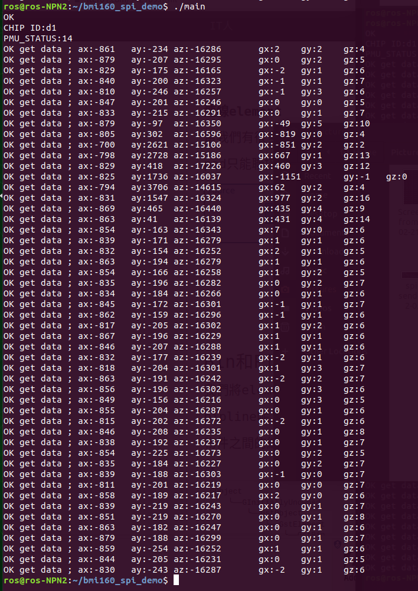

# 1. Introduction


This is a demo to show how to get the data of **BMI160** by **SPI ioctl** in **ROScube Pico**.

The data includes:

> -   CHIP ID
> -   PMU STATUS
> -   SENSOR DATA (ACCEL and GYRO).

### **NOTE**
------------

The model supported by BMI160 is only the **ROScube Pico series**. 

In this BMI160 demo, by using `/dev/spidev2.0`.


# 2. Build


Download the code.

```
git clone https://github.com/Adlink-ROS/bmi160_spi_demo.git
cd bmi160_spi_demo
```

# 3. Usage

Test the demo following the command.

## i. Compile the code by gcc

```
gcc -o bmi160_test main.c bmi160.c
```

## ii. Run the code

```
./bmi160_test
```

## iii. Result

If successfully worked, it will show data:

> -   CHIP ID: `0xD1`
> -   PMU STATUS: `0x14`
> -   SENSOR DATA: **50 points**
 



### **NOTE**
------------

It will show **OK** message on the first line, that means `bmi160_perform_self_test` was successful.

### **WARNING**
---------------
When occurred filed or error, please check the **Error Value** from
[bmi160.h](https://github.com/Adlink-ROS/bmi160_spi_demo/blob/88b37d14e1af33a44c467a1e3edfea82e5dc0ad2/bmi160_defs.h#L342).

